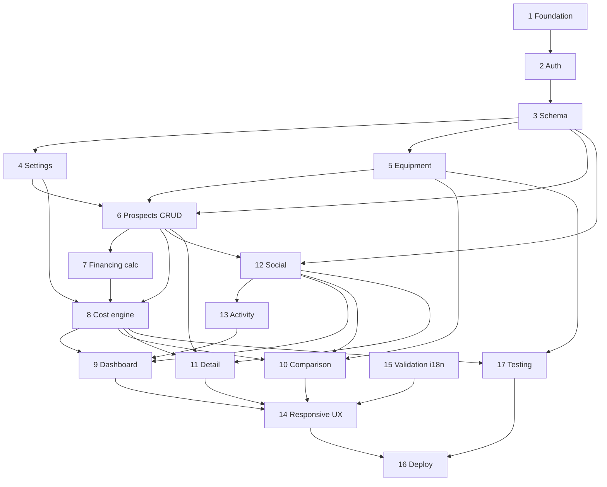

# Car Comparison App — Implementation Epics

> Stack: TanStack Start · TanStack Router · Convex · Convex Auth (email/password) · shadcn/ui · Tailwind · Vercel  
> Locale: **Swedish UI copy only** · **English route paths** · SEK only · Swedish mile consumption · km annual distance  
> UX: Forms → drawers (side desktop / fullscreen mobile) · Dialogs → confirm/destructive only

### Routing vs i18n

- **Routes:** English slugs (`/login`, `/prospects`, `/compare`) — code, links, router files
- **UI:** Swedish labels, validation, empty states, activity messages (`Lägg till bil`, `Senaste händelser`, …)

---

## Library recommendations

| Area       | Choice                           | Why                                                                          |
| ---------- | -------------------------------- | ---------------------------------------------------------------------------- |
| Framework  | TanStack Start                   | SSR, file routing, Vercel-friendly                                           |
| Routing    | TanStack Router                  | Type-safe routes, loaders, search params                                     |
| Data       | Convex React hooks               | Real-time shared state; skip TanStack Query unless caching non-Convex assets |
| Forms      | TanStack Form + Zod              | Complex nested prospect/financing forms, drawer-friendly                     |
| Tables     | TanStack Table                   | Desktop comparison with sticky columns                                       |
| Charts     | Recharts                         | Line chart for 120-month cumulative cost; shadcn chart wrapper exists        |
| Tests      | Vitest                           | Fast unit tests for cost engine                                              |
| Formatting | `Intl.NumberFormat('sv-SE')`     | `600 000 kr` currency                                                        |
| Validation | Zod schemas shared client/server | Single source for forms + Convex validators                                  |

---

## Epic 1: Project foundation & tooling

### Goal

Bootstrap production-ready monorepo with TanStack Start, Convex, shadcn, Tailwind, Vercel deploy (Vercel will deploy on push to main).

### User value

Team can develop, lint, test, and deploy from day one.

### Scope

- TanStack Start app scaffold
- npm package manager
- Convex project init + dev scripts
- shadcn/ui + Tailwind theme (Swedish-friendly typography)
- Biome formatting and lint, TypeScript strict
- Vitest setup
- Vercel project link + env vars (`CONVEX_URL`, deployment URL)
- Base layout shell (header, nav, auth gate placeholder)
- Drawer/dialog primitives configured (shadcn Sheet + Dialog)
- Swedish locale constants module (`lib/i18n/sv.ts`)

### Out of scope

- Feature pages, auth logic, schema

### User stories

- Dev runs `npm dev` → app + Convex hot reload
- Dev deploys preview to Vercel with Convex prod/dev separation

### Technical tasks

- `create-start-app` or manual TanStack Start setup
- `npx convex dev` integration
- shadcn init + Sheet, Dialog, Button, Input, Form, Table, Chart
- Responsive breakpoint tokens (desktop-first)
- `vercel.json` if needed for Start
- README with setup steps

### Data model impact

None

### Acceptance criteria

- [x] App builds locally and on Vercel preview
- [x] Convex connected; health query returns OK
- [x] Base layout renders Swedish placeholder nav
- [x] Sheet opens side on `md+`, fullscreen below `md`
- [x] Dialog reserved for confirm pattern documented in `docs/UX.md`

### Dependencies

None

### Risks / open questions

- TanStack Start + Convex SSR pattern — verify official Convex Start guide at scaffold time
- Vercel env sync for Convex deploy key

---

## Epic 2: Authentication & user profiles

### Goal

Email/password auth via Convex Auth; every route requires login; user profile with display name.

### User value

Household members identify themselves; all actions attributed.

### Scope

- Convex Auth email/password (sign up, sign in, sign out)
- Auth-protected route layout
- Profile: display name, email, optional avatar/initials, createdAt
- First-login profile completion drawer if display name missing
- Swedish auth UI copy (errors, labels)
- Redirect unauthenticated → `/login`

### Out of scope

- Guest mode, OAuth, admin roles, **password reset email** (explicitly not MVP)

### User stories

- User registers and lands on dashboard
- User sees own name on ratings/activity attribution
- Unauthenticated user cannot access app routes

### Technical tasks

- Convex Auth config + `users` table sync
- `auth.ts` helpers: `getCurrentUser`, `requireAuth`
- Routes: `/login`, `/register` (or combined auth page)
- Profile mutation on signup / settings drawer
- Avatar: initials fallback component
- Session persistence + logout

### Data model impact

```ts
users: {
  email, name, imageUrl?, createdAt
  // Convex Auth links auth identity
}
```

### Acceptance criteria

- [ ] No guest access to `/_authenticated/*` routes
- [ ] Display name shown in header
- [ ] Auth errors in Swedish
- [ ] Multiple users can coexist in same deployment

### Dependencies

Epic 1

### Risks / open questions

- None blocking — password reset out of scope per product decision

---

## Epic 3: Convex schema & shared data layer

### Goal

Define full schema, indexes, validators, and seed helpers for shared household data.

### User value

Consistent data model supports all features; real-time sync across users.

### Scope

- All tables (see schema outline below)
- Convex validators (Zod mirror where useful)
- Indexes for queries (prospect by status, activity by time, ratings by prospect)
- `globalSettings` singleton with defaults
- Seed script: default equipment categories, sample settings
- Activity event helper: `logActivity(type, actorId, target, metadata)`

### Out of scope

- UI, cost calculations

### User stories

- All users see same prospects after any user creates one
- Global settings readable by all authenticated users

### Technical tasks

- `convex/schema.ts` full definition
- Mutations/queries stubs per entity
- `globalSettings` get-or-create on first app load
- Equipment category enum
- Status enums: prospect `active` | `archived` | `deleted` (archive first, then delete)
- Foreign keys via `v.id()` references

### Data model impact

Full schema (Epic 3 is the schema epic)

### Acceptance criteria

- [x] Schema deploys without errors
- [x] Seed populates global settings + equipment categories
- [x] CRUD smoke tests via Convex dashboard
- [x] All tables enforce auth on mutations

### Dependencies

Epic 2

### Risks / open questions

- Embed financing on prospect vs separate table → embed for MVP simplicity
- Activity events: append-only log vs derived — recommend append-only for dashboard feed

---

## Epic 4: Global settings

### Goal

Shared household assumptions for energy/hybrid calculations and ownership period.

### User value

One place to set fuel prices, driving distance; all cost projections stay consistent.

### Scope

- Settings page or drawer: annual km, petrol/diesel/kWh prices, hybrid %, hybrid consumption globals, default 120 months
- Edit by any logged-in user (MVP)
- Activity event on change
- Swedish labels + SEK/kWh/L validation

### Out of scope

- Per-user settings, admin-only edit (later)

### User stories

- User updates diesel price → all prospect energy costs recalculate
- User sets annual distance 15000 km → monthly fuel costs update

### Technical tasks

- `globalSettings` query (reactive)
- `updateGlobalSettings` mutation + validation
- Settings drawer form (TanStack Form + Zod)
- Format helpers for units in UI

### Data model impact

`globalSettings` singleton document

### Acceptance criteria

- [x] Defaults seeded on first load
- [x] Invalid percentages rejected (0–100)
- [x] Change logged in activity feed
- [x] All users see updated values live

### Dependencies

Epic 3

### Risks / open questions

- Who can edit in v2? MVP: all users OK for household app

---

## Epic 5: Equipment management

### Goal

Reusable equipment catalog with categories and must-have / nice-to-have classification.

### User value

Household agrees on requirements; comparison highlights gaps and wins.

### Scope

- Equipment CRUD (predefined items)
- Categories: Safety, Comfort, Winter, Audio, Driver assistance, Practical, Performance, Charging/electric, Other
- Priority: must-have | nice-to-have | neutral
- Free-text tags on prospects (Epic 6 links here)
- Equipment management page + add/edit drawer
- Duplicate name prevention (case-insensitive)

### Out of scope

- Package pricing, optional add-ons, per-car optional equipment

### User stories

- User marks "Dragkrok" as must-have
- User adds custom predefined "Panoramatak"
- Prospect missing must-have shows warning (Epic 12)

### Technical tasks

- `equipment` table CRUD
- Category + priority enums
- List/filter UI by category
- Delete guard if referenced by prospects

### Data model impact

```ts
equipment: { name, category, priority, createdAt, createdBy }
prospectEquipment: { prospectId, equipmentId, isPresent: boolean }
// OR embedded equipmentIds on prospect — join table preferred for queries
```

### Acceptance criteria

- [x] CRUD works in drawer forms
- [x] Must-have/nice-to-have badges in list
- [x] Duplicate names blocked with Swedish error
- [x] Deleting equipment updates prospect joins

### Dependencies

Epic 3, Epic 2

### Risks / open questions

- Free-text tags: store as `string[]` on prospect separate from predefined IDs

---

## Epic 6: Car prospect CRUD

### Goal

Full create/read/update/archive for car prospects with all core fields.

### User value

Household captures listings under consideration with complete cost inputs.

### Scope

- Prospect fields: identity, engine type, purchase method, prices, running costs, equipment links, tags, status
- Purchase completion items (sub-CRUD on prospect)
- Source links (sub-CRUD)
- Financing fields when method = financed
- List page with filters (active / archived)
- Add/edit prospect in drawer (multi-step or sections)
- **Lifecycle:** active → archive (confirm dialog) → delete from archived (confirm dialog, permanent)
- Optional **handpenning** field when purchase method = financed
- Activity events on create/update/archive/delete

### Out of scope

- Cost graph (Epic 8), comparison table (Epic 10)

### User stories

- User adds Volvo XC60 listing with cash purchase and equipment
- User adds financed BMW with manual monthly payment
- User archives sold listing; later permanently deletes from archived list

### Technical tasks

- `prospects` mutations: create, update, archive, delete (delete only when archived)
- `purchaseItems` nested CRUD
- `sourceLinks` nested CRUD
- `prospectEquipment` sync from form
- Prospect list with status filter
- Form sections: Identitet, Pris, Finansiering, Driftskostnader, Utrustning, Länkar
- Swedish validation messages

### Data model impact

```ts
prospects: {
  brand, model, title, modelYear?, registrationYear?, mileage?,
  engineType: petrol|diesel|electric|hybrid,
  purchaseMethod: cash|financed,
  buyPriceSek, packageDescription?,
  insuranceMonthlySek, taxYearlySek,
  serviceSmallSek, serviceBigSek, serviceIntervalMonths,
  fuelConsumption?, // L/mil petrol/diesel; kWh/mil electric; null hybrid
  financing?: { downPaymentSek?, // handpenning — upfront at month 0
                monthlyPayment, interestRate, monthlyAdminFee, yearlyFee?,
                periodMonths, restValueSek, useAutoCalc },
  equipmentTagIds[], freeTextEquipmentTags[],
  status, createdBy, createdAt, updatedAt
}
purchaseItems: { prospectId, title, costSek, paidUpfront: true }
sourceLinks: { prospectId, title, url, description?, createdBy, createdAt }
```

### Acceptance criteria

- [x] All required fields validated
- [x] Financed vs cash toggles correct form sections
- [x] Completion items sum into effective upfront cost (engine uses this)
- [x] Archived prospects hidden from active dashboard/comparison defaults
- [x] Deleted prospects excluded from all lists; activity history may still reference them
- [x] Handpenning field shown only for financed purchases
- [x] createdBy populated from auth

### Dependencies

Epic 3, Epic 5, Epic 4

### Risks / open questions

- Hybrid: no per-car consumption — UI must hide those fields for hybrid

---

## Epic 7: Financing calculator

### Goal

Transparent auto-calculate monthly payment with full manual override.

### User value

Users trust financing numbers; can match bank quote exactly.

### Scope

- Optional **handpenning** (`downPaymentSek`): paid upfront at month 0; loan principal = `buyPriceSek − downPaymentSek`
- Auto-calculate monthly payment from principal (+ interest %, period months, rest value)
- Upfront at month 0 for financed: handpenning + upfront completion items (not full buy price)
- Formula documented in code comments + UI tooltip (Swedish)
- "Beräkna automatiskt" button fills suggestion; user can edit after
- No balloon option (= rest value 0)
- Rest value spike at month N in cost engine

### Out of scope

- Amortization schedule UI, multiple loans

### User stories

- User clicks auto-calc → gets suggested 5 000 kr/mån; overrides to 4 950
- User sets rest value 420 000 → graph shows spike month 36

### Technical tasks

- Pure function `calculateMonthlyPayment({ principal, annualRate, months, balloon })`
- `principal = buyPriceSek - (downPaymentSek ?? 0)` — handpenning never included in loan
- Unit tests: full price financed, handpenning reduces principal, zero handpenning
- Form integration: auto-calc does not lock field
- UI shows: handpenning + lånebelopp + månadskostnad (Swedish labels)

### Data model impact

Fields on `prospects.financing`

### Acceptance criteria

- [x] Manual entry always wins over auto value
- [x] Auto-calc matches documented formula within rounding (SEK integer)
- [x] Zero interest edge case handled
- [x] restValue = 0 supported (fully amortizing)
- [x] Handpenning increases month-0 upfront; decreases loan principal for auto-calc

### Dependencies

Epic 6

### Risks / open questions

- Standard formula: annuity with balloon FV — document explicitly in `lib/finance/amortization.ts`

---

## Epic 8: Cost calculation engine

### Goal

Deterministic, testable 120-month cost model with category breakdown.

### User value

Trustworthy 10-year comparison; core product promise.

### Scope

- Pure TypeScript module (no Convex/UI deps)
- Input: prospect + globalSettings + equipment flags (for warnings only)
- Output: `MonthlyCostRow[120]`, cumulative totals, category breakdown, 3/5/10-year totals
- Categories: purchase, completionItems, financingPayment, financingFees, balloon, insurance, tax, service, energy
- Rules: handpenning at month 0, tax + yearly finance fees on calendar-month cadence (every 12 projection months), service alternation, energy by engine type
- Hybrid uses global assumptions only

### Out of scope

- Depreciation, resale

### User stories

- User sees same numbers on dashboard, comparison, and detail
- Developer runs unit tests in CI

### Technical tasks

- `lib/cost-engine/` module structure
- `buildMonthlySchedule(prospect, settings, completionItems)`
- `computeEnergyMonthly(prospect, settings)`
- `computeServiceEvents(interval, small, big, months=120)`
- Aggregators for 36/60/120 month totals
- 12 unit tests (spec cases 1–12) + **handpenning financed case**
- Convex query wrapper returning computed costs (or compute client-side — prefer shared pure fn imported both places)

### Data model impact

None (derived); optional cache table later — not MVP

### Acceptance criteria

- [x] All 12 representative unit tests pass
- [x] Cash: month 0 spike = buyPrice + upfront completion items
- [x] Financed: month 0 = handpenning + upfront completion items; monthly payment each month; balloon at period end
- [x] Tax + yearly finance fee: calendar-month cadence — every 12 projection months `(m + 1) % 12 === 0`
- [x] Service alternates small/big from month = interval
- [x] Integer SEK rounding policy documented (round each line item)

### Dependencies

Epic 4, Epic 6, Epic 7

### Risks / open questions

- Compute client-side vs server — recommend pure fn + client compute for responsiveness; Convex action if secrets needed (none)
- Month 0 vs month 1 indexing — document as month index 0..119

---

## Epic 9: Dashboard

### Goal

Main hub: 10-year chart, top rated, activity feed, my reminders.

### User value

Household sees cost trajectory and social signals at a glance.

### Scope

- 10-year cumulative line chart (active prospects only; archived/deleted excluded)
- **Vetoed prospects:** dashed line on chart + badge; quick action to archive
- Highest-rated list (avg score, count; vetoes de-prioritized or badged)
- 10 latest activity events (Swedish messages)
- My reminders list (current user only)
- Empty states in Swedish
- Quick actions: add prospect, open settings

### Out of scope

- Full comparison (Epic 10)

### User stories

- User opens app → sees cost lines for 3 cars
- User sees "Anna satte betyg 4/5 på Kia EV6"
- User sees personal reminder for Tesla Model Y

### Technical tasks

- Dashboard route `/` or `/dashboard`
- Recharts multi-line chart component
- Legend, colors per prospect, tooltip with SEK format
- Queries: activeProspects, ratingsAggregate, activityFeed(limit 10), myReminders
- Veto styling: **dashed line** + "Veto" badge; archive action in legend/card menu

### Data model impact

Read-only aggregations

### Acceptance criteria

- [x] Chart shows 120 months, one line per active prospect
- [x] Spikes visible (purchase, tax, service, balloon)
- [x] Top rated sorted by average desc; shows `(n betyg)`
- [x] Activity feed max 10, newest first, Swedish copy
- [x] Reminders only for `ctx.auth.userId`
- [x] Vetoed lines rendered dashed; user can archive vetoed prospect from dashboard

### Dependencies

Epic 8, Epic 11 (ratings/veto/reminders), Epic 12 (activity)

### Risks / open questions

- None — veto = dashed line + archive option (product decision)

---

## Epic 10: Comparison UI

### Goal

Side-by-side desktop comparison + mobile card layout with key cost/equipment signals.

### User value

Decision-makers compare candidates on numbers and requirements quickly.

### Scope

- Route `/compare` with multi-select prospects (or compare all active)
- Desktop: TanStack Table, sticky first column, grouped sections
- Mobile: cards + collapsible sections
- Fields per spec: prices, financing summary, running costs, 3/5/10yr totals, equipment warnings, ratings, vetoes, links
- Equipment warning icons + popover (desktop hover, mobile tap)

### Out of scope

- Export PDF

### User stories

- User compares 3 SUVs on 10-year cost and must-have equipment
- Mobile user expands "Driftskostnader" on card

### Technical tasks

- Comparison page + prospect picker
- `ComparisonTable` (desktop) + `ComparisonCards` (mobile)
- Reuse cost engine for 3/5/10 totals
- `EquipmentWarningBadge` + popover listing missing must-haves
- `NiceToHaveIndicator` for included items
- Responsive switch at `lg` breakpoint

### Data model impact

None

### Acceptance criteria

- [x] All spec comparison fields present
- [x] Table horizontal scroll on medium desktop if many columns
- [x] Must-have missing shows red icon + popover list
- [x] Nice-to-have included shows positive indicator
- [x] No cramped side-by-side on mobile

### Dependencies

Epic 8, Epic 5, Epic 11

### Risks / open questions

- Max prospects compared at once? Recommend: unlimited active but UI warns >5 columns

---

## Epic 11: Prospect detail page

### Goal

Deep view of one prospect: breakdown, notes, ratings, links, edit entry points.

### User value

Drill into one listing before household discussion.

### Scope

- Route `/prospects/$prospectId`
- Sections: header, cost summary (3/5/10 yr), detailed monthly breakdown chart/table (optional expand), financing block, running costs, equipment, purchase items, source links
- Actions: edit (drawer), rate, veto, remind, add note — all via drawers except confirm on archive
- Per-user rating display + average

### Out of scope

- Edit history diff

### User stories

- User views month-by-month cost breakdown for financed car
- User adds note visible to all users

### Technical tasks

- Detail layout + breadcrumbs
- Cost breakdown sub-chart (stacked or category filter)
- Inline equipment list with must/nice badges
- Link list with external open
- Action bar with attribution tooltips

### Data model impact

Read + mutations from Epic 11 sub-features

### Acceptance criteria

- [x] All prospect fields displayed in Swedish labels
- [x] Edit opens same form drawer as create (pre-filled)
- [x] 404 for invalid/archived if policy hides removed

### Dependencies

Epic 6, Epic 8, Epic 11 (social features below)

### Risks / open questions

- Detailed breakdown: table vs chart — recommend toggle "Visa detaljer"

---

## Epic 12: Notes, ratings, vetoes & reminders

### Goal

Collaborative household signals with attribution.

### User value

"Anna vetoed Volvo" — transparent household negotiation.

### Scope

- Notes: CRUD, visible all, edited timestamp
- Ratings: 1–5, one per user per prospect, editable
- Vetoes: per user, undoable, show who vetoed
- Reminders: per user, dashboard list only for self
- Activity events for all actions
- UI on detail page + compact on comparison/list

### Out of scope

- Threaded comments, @mentions

### User stories

- Erik vetoes BMW 530e → shows on prospect + activity
- Anna rates 4/5 → average updates
- User removes reminder → gone from dashboard only for them

### Technical tasks

- Tables: `notes`, `ratings`, `vetoes`, `reminders`
- Mutations with uniqueness constraints (rating, veto per user+prospect)
- Components: `RatingControl`, `VetoButton`, `ReminderToggle`, `NotesList`, `NoteForm` (drawer)
- Aggregate query: avg rating + count per prospect
- Confirm dialog only for note delete (optional)

### Data model impact

```ts
notes: { prospectId, userId, text, createdAt, updatedAt? }
ratings: { prospectId, userId, score 1-5, updatedAt }
vetoes: { prospectId, userId, createdAt }
reminders: { prospectId, userId, createdAt }
```

### Acceptance criteria

- [x] One rating per user enforced
- [x] Veto undo removes row + activity event
- [x] Notes show author name + timestamp
- [x] Reminder not visible to other users' dashboards

### Dependencies

Epic 3, Epic 6

### Risks / open questions

- Multiple vetoes: show count + names list
- Rating affects sort only; veto affects visual not calculation

---

## Epic 13: Activity feed system

### Goal

Append-only audit of meaningful events with Swedish rendering.

### User value

Household awareness of changes without notifications noise.

### Scope

- Event types: create, update, archive, **delete**, note, rating, veto, reminder, link, equipment, settings
- `logActivity` called from all relevant mutations
- Swedish message templates with actor + target interpolation
- Dashboard widget (10 items)
- Optional full `/aktivitet` page (nice-to-have in MVP if time)

### Out of scope

- Push notifications, email digests

### User stories

- Feed shows "Erik lade till länk till Skoda Enyaq"

### Technical tasks

- `activityEvents` table + index by `createdAt desc`
- Template map: `ACTIVITY_SV[type](ctx)`
- Hook into all mutations from Epics 4–12

### Data model impact

```ts
activityEvents: {
  type, actorUserId, prospectId?, entityId?, message, metadata?, createdAt
}
```

### Acceptance criteria

- [x] All listed action types emit events
- [x] Messages grammatically correct Swedish
- [x] Feed query <50ms for 10 items

### Dependencies

Epic 3; integrated across feature epics

### Risks / open questions

- Edited prospect: single "uppdaterad" vs granular — MVP: one event per save with changed fields in metadata optional

---

## Epic 14: Responsive UX, drawers & polish

### Goal

Desktop-first responsive app; consistent drawer/dialog patterns; loading/error/empty states.

### User value

Works well on couch phone and kitchen laptop.

### Scope

- Breakpoint strategy: drawers, comparison layout, chart responsiveness
- Loading skeletons, error boundaries, toast errors (Swedish)
- Empty states all lists
- Focus trap in fullscreen mobile drawers
- Chart resizes on mobile (simplified legend)
- Touch-friendly tap targets

### Out of scope

- Native app, offline mode

### User stories

- Mobile user adds prospect in fullscreen drawer
- User sees skeleton while prospects load

### Technical tasks

- `useMediaQuery` or CSS for drawer variant
- Shared `FormDrawer` wrapper
- `ConfirmDialog` for destructive actions only
- Error page `/fel`
- Consistent `EmptyState` component

### Data model impact

None

### Acceptance criteria

- [x] Zero forms in Dialog (except confirm)
- [x] All CRUD forms use Sheet drawer
- [x] Mobile drawer 100vh; desktop max-w-lg side sheet
- [x] Lighthouse mobile usability pass on key routes

### Dependencies

All UI epics

### Risks / open questions

- Chart readability on small screens — allow horizontal scroll on chart container

---

## Epic 15: Validation, errors & i18n completeness

### Goal

Shared Zod schemas; Swedish messages everywhere; SEK/km/mil formatting.

### User value

No confusing English errors; trustworthy number display.

### Scope

- Zod schemas: prospect, financing, settings, equipment, links, ratings
- Shared `formatSek`, `formatConsumption`, `formatDistance`
- Field-level form errors in Swedish
- URL validation for source links
- Positive number guards

### Out of scope

- Multi-language

### User stories

- User enters negative insurance → "Måste vara positivt tal"

### Technical tasks

- `lib/validation/*.ts` schemas
- Map Zod errors → Swedish in form layer
- Convex `args` validators mirror schemas
- Currency input masking optional (integer SEK sufficient MVP)

### Data model impact

Validator alignment only

### Acceptance criteria

- [ ] No raw English validation strings in UI
- [ ] SEK displayed as `600 000 kr`
- [ ] Percentages show `%` suffix Swedish style

### Dependencies

Epic 1; applied across all forms

### Risks / open questions

- Decimal liters/kWh per mil — allow 1 decimal

---

## Epic 16: Deployment, CI & production hardening

### Goal

Reliable Vercel + Convex production deployment with CI checks.

### User value

App always available for household decisions.

### Scope

- GitHub → Vercel preview + production
- Convex prod deployment linked
- CI: typecheck, lint, vitest (cost engine)
- Env documentation
- Auth redirect URLs configured for prod domain
- Basic security: all Convex functions require auth except auth routes

### Out of scope

- Monitoring/alerting (Sentry later)

### User stories

- Push to main → production deploy succeeds
- PR runs tests

### Technical tasks

- GitHub Actions workflow
- Convex deploy on merge
- Production smoke checklist
- CSP headers if needed

### Data model impact

None

### Acceptance criteria

- [ ] CI green on main
- [ ] Prod auth works on custom domain
- [ ] No public unauthenticated data leaks (Convex rules audit)

### Dependencies

All epics for full E2E; pipeline after Epic 1

### Risks / open questions

- Convex + Vercel env var rotation process

---

## Epic 17: Testing strategy implementation

### Goal

Automated confidence for cost engine and critical paths.

### User value

Regressions don't break household trust in numbers.

### Scope

- Unit: cost engine (12 cases), financing calculator
- Unit: equipment must-have / nice-to-have detection helpers
- Integration: Convex function tests (convex-test) for key mutations
- Manual E2E checklist document
- Optional Playwright smoke (login → add prospect → see chart) if time

### Out of scope

- Full Playwright suite MVP

### User stories

- Dev changes tax timing → unit test fails

### Technical tasks

- Vitest config + test files per spec case
- CI runs `npm test`
- `docs/TEST_PLAN.md` manual scenarios

### Data model impact

None

### Acceptance criteria

- [ ] 12 cost engine tests green
- [ ] Equipment detection tests green
- [ ] CI blocks merge on failure

### Dependencies

Epic 8, Epic 5

### Risks / open questions

- convex-test setup complexity — prioritize pure fn tests first

---

## Suggested implementation order

```
Phase A — Foundation
  1 → 2 → 3 → 4

Phase B — Domain core
  5 → 6 → 7 → 8

Phase C — Social & data
  12 → 13 (wire activity as features land)

Phase D — Primary UI
  9 → 11 → 10

Phase E — Polish & ship
  14 → 15 → 17 → 16
```

Parallel tracks after Epic 3:

- Track A: 5 → 6 → 7 → 8
- Track B: 12 + 13 (can start after 6)

---

## MVP milestone split

### Milestone 1 — "Kan logga in och lägga till bil" (≈2 weeks)

Epics: 1, 2, 3, 4, 5, 6 (basic), 15 (partial)

- Auth works
- Settings + equipment catalog
- Create/edit prospect (cash only OK initially)
- Swedish UI shell

### Milestone 2 — "Siffror man litar på" (≈2 weeks)

Epics: 7, 8, 17

- Financing + auto-calc
- Cost engine + all unit tests
- Completion items in engine

### Milestone 3 — "Dashboard och detalj" (≈1.5 weeks)

Epics: 9, 11, 12, 13

- Dashboard chart
- Detail page
- Notes, ratings, veto, reminders
- Activity feed

### Milestone 4 — "Jämför och ship" (≈1.5 weeks)

Epics: 10, 14, 16

- Comparison UI
- Responsive polish
- Production deploy

---

## Recommended Convex schema outline

```ts
// convex/schema.ts (conceptual)

users; // synced with Convex Auth + profile fields

globalSettings; // singleton: driving km, fuel prices, hybrid globals, ownershipMonths

equipment; // name, category, priority (must|nice|neutral)

prospects; // full car record + embedded financing object + status + tags

prospectEquipment; // prospectId, equipmentId, isPresent

purchaseItems; // prospectId, title, costSek, paidUpfront

sourceLinks; // prospectId, title, url, description?, createdBy

notes; // prospectId, userId, text, timestamps

ratings; // prospectId, userId, score — index (prospectId, userId) unique

vetoes; // prospectId, userId — index (prospectId, userId) unique

reminders; // prospectId, userId — index (prospectId, userId) unique

activityEvents; // type, actorUserId, prospectId?, message, metadata, createdAt
```

**Indexes**

- `prospects.by_status`
- `activityEvents.by_createdAt`
- `ratings.by_prospectId`
- `notes.by_prospectId`

**Auth rules pattern**

- All reads/writes: `requireAuth(ctx)`
- No row-level user isolation (shared household)
- Mutations set `createdBy = userId` for attribution

---

## Recommended TanStack Router structure

> Route **paths and file names = English**. Nav labels, page titles, buttons = Swedish via `lib/i18n/sv.ts`.

```
routes/
  __root.tsx                 // providers, error boundary
  _authenticated.tsx         // auth gate layout
  _authenticated/
    index.tsx                // dashboard → UI: "Översikt"
    prospects/
      index.tsx              // list → UI: "Bilar"
      $prospectId.tsx        // detail
    compare.tsx              // UI: "Jämför"
    equipment.tsx            // UI: "Utrustning"
    settings.tsx             // UI: "Inställningar"
    activity.tsx             // optional → UI: "Aktivitet"
  login.tsx                  // UI: "Logga in"
  register.tsx               // UI: "Registrera" (or single /login with tab)
```

**Loaders**

- Prefetch `globalSettings` in `_authenticated` loader
- Prospect detail loader: prospect + ratings aggregate + notes

**Search params**

- `/compare?ids=id1,id2,id3`
- `/prospects?status=active|archived`

---

## Recommended component structure

```
src/
  components/
    ui/                      // shadcn
    layout/
      AppHeader.tsx
      AppNav.tsx
      FormDrawer.tsx         // side | fullscreen
      ConfirmDialog.tsx
    prospects/
      ProspectForm.tsx
      ProspectCard.tsx
      ProspectList.tsx
      FinancingFields.tsx
      PurchaseItemsEditor.tsx
      SourceLinksEditor.tsx
    equipment/
      EquipmentForm.tsx
      EquipmentBadge.tsx
      EquipmentWarningPopover.tsx
      NiceToHaveIndicator.tsx
    costs/
      CostLineChart.tsx
      CostSummaryCards.tsx
      CostBreakdownTable.tsx
    comparison/
      ComparisonTable.tsx    // TanStack Table
      ComparisonCards.tsx    // mobile
    social/
      RatingControl.tsx
      VetoButton.tsx
      ReminderToggle.tsx
      NotesList.tsx
      ActivityFeed.tsx
    settings/
      GlobalSettingsForm.tsx
  lib/
    cost-engine/
      index.ts
      schedule.ts
      energy.ts
      service.ts
      types.ts
    finance/
      amortization.ts
    validation/
      prospect.ts
      settings.ts
    i18n/
      sv.ts
    format/
      currency.ts
      units.ts
  routes/                    // TanStack Start routes
convex/
  schema.ts
  prospects.ts
  equipment.ts
  settings.ts
  social.ts                  // notes, ratings, vetoes, reminders
  activity.ts
  auth.config.ts
```

---

## Suggested cost calculation model

```ts
type CostCategory =
  | 'purchase'
  | 'completionItems'
  | 'financingPayment'
  | 'financingFees'
  | 'balloon'
  | 'insurance'
  | 'tax'
  | 'service'
  | 'energy'

type MonthIndex = 0 | ... | 119

interface MonthLineItem {
  category: CostCategory
  amountSek: number // integer
  label?: string   // debug/detail only
}

interface MonthlyCostRow {
  month: MonthIndex
  items: MonthLineItem[]
  monthTotalSek: number
  cumulativeSek: number
}

interface CostProjection {
  months: MonthlyCostRow[]
  totals: { months36: number; months60: number; months120: number }
  byCategory: Record<CostCategory, number>
}
```

**Algorithm sketch (month `m`, 0-indexed)**

1. **m === 0, cash**: add `buyPriceSek` + sum(completionItems where paidUpfront)
2. **m === 0, financed**: add `(downPaymentSek ?? 0)` + sum(completionItems where paidUpfront) — not full buy price
3. **Financed, m < periodMonths**: add `monthlyPayment` + `monthlyAdminFee`
4. **Financed, yearly fee**: add on **calendar-month cadence** — same months as tax (every 12 months: months 11, 23, 35, … i.e. `(m + 1) % 12 === 0`)
5. **Financed, m === periodMonths - 1** (or end month): add `restValueSek` balloon
6. **Every month**: add `insuranceMonthlySek`
7. **Tax (calendar-month cadence):** `(m + 1) % 12 === 0` → add `taxYearlySek` (months 11, 23, … = end of each projection year; evens out over 10 years — not tied to registration anniversary)
8. **Service**: at months `interval-1, 2*interval-1, ...` alternate small/big starting small
9. **Energy**: monthly from `computeEnergyMonthly(prospect, settings)`

**Hybrid energy**

```
monthlyKm = annualKm / 12
fuelShare = hybridFuelPercent / 100
fuelCost = monthlyKm * globalHybridLitersPerMil * fuelShare * dieselOrPetrolPrice
elecCost = monthlyKm * globalHybridKwhPerMil * (1 - fuelShare) * kwhPrice
```

**Equipment helpers (not in cost total)**

```ts
missingMustHave(prospect, equipmentCatalog, joins) → Equipment[]
includedNiceToHave(prospect, equipmentCatalog, joins) → Equipment[]
```

---

## Testing strategy

| Layer             | Tool                  | Coverage                                                              |
| ----------------- | --------------------- | --------------------------------------------------------------------- |
| Cost engine       | Vitest                | 12 spec cases + handpenning financed case + edge (0 rest, 0 interest) |
| Financing calc    | Vitest                | annuity cases incl. handpenning reduces principal                     |
| Equipment helpers | Vitest                | must-have missing, nice-have present                                  |
| Convex mutations  | convex-test           | create prospect, rating uniqueness, veto undo                         |
| UI                | Manual checklist      | Auth, drawer UX, chart, comparison                                    |
| E2E smoke         | Playwright (optional) | Login → create cash prospect → dashboard line                         |

**CI pipeline**

```yaml
- npm typecheck
- npm lint
- npm test # vitest
- npm build
```

---

## Product decisions (resolved)

| #   | Question                         | Decision                                                                                                                                  |
| --- | -------------------------------- | ----------------------------------------------------------------------------------------------------------------------------------------- |
| 1   | Handpenning on finance?          | **Yes.** Optional field. Month-0 upfront. Loan principal = buy price − handpenning. Auto-calc uses remaining amount.                      |
| 2   | Password reset email?            | **No.** Out of MVP scope.                                                                                                                 |
| 3   | Vetoed prospects on chart?       | **Dashed line** + badge. User can **archive** from dashboard.                                                                             |
| 4   | Archive vs delete?               | **Two-step:** archive first (soft hide), then **permanent delete** from archived (confirm dialog).                                        |
| 5   | Tax + yearly finance fee timing? | **Calendar-month cadence** — charge every 12 projection months (months 11, 23, …). Not registration anniversary. Evens out over 10 years. |
| 6   | Route language?                  | **English paths** (`/prospects`, `/compare`). **Swedish UI text only.**                                                                   |

## Open questions (remaining)

1. **Global settings edit permissions** — all users OK for MVP; lock later?
2. **Activity granularity** — one event per prospect save vs field-level diff?
3. **Max prospects** — performance limit for chart (unlikely issue <20 cars)?
4. **Source link PDFs** — URL only sufficient?
5. **Deleted prospect activity** — keep feed entries with snapshot name, or redact?

---

## Epic dependency graph (summary)



---

_Generated for car-comparison project. Spec: Headroom `c437eadc78db039e635753e3`. Decisions: Headroom `1a24db5bac1e5bc4e576b7df`._
